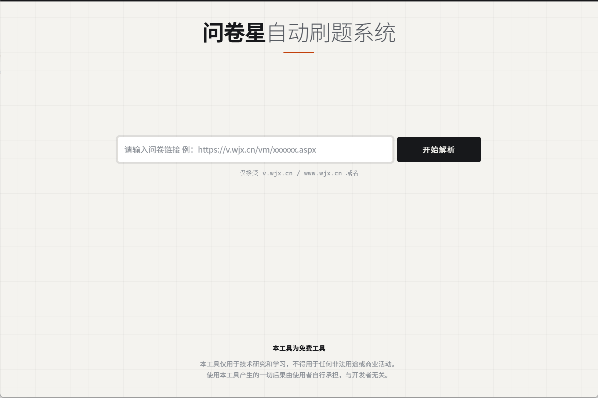
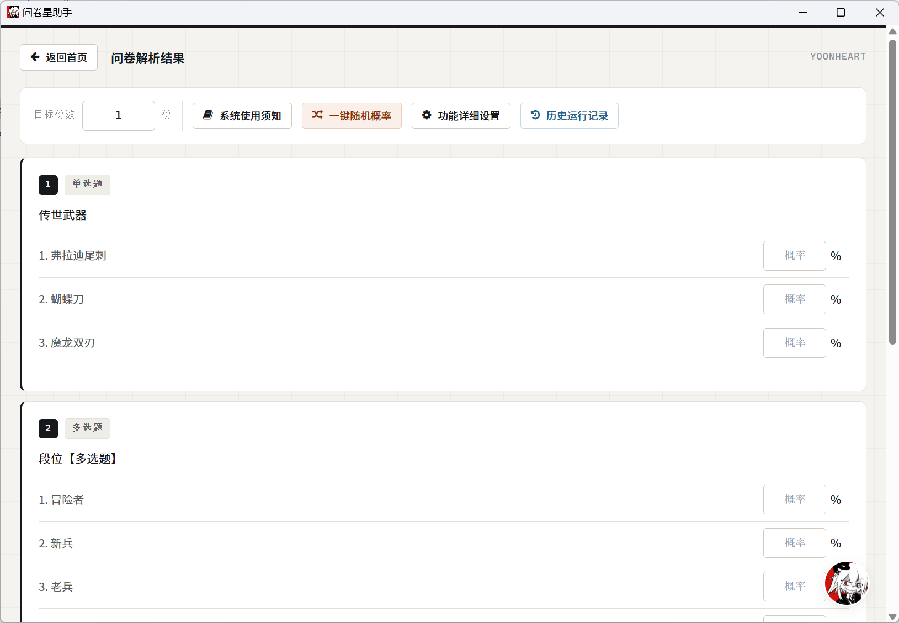

# 问卷星助手（wjx-desktop）目前只支持Windows

> **1.0 Windows 桌面版 / Windows release**：把问卷星自动填写做成了开箱即用的桌面软件 ——
> 内置浏览器窗口、内嵌 JDK 与 Python、驱动自动下载。**双击就能用，新机零环境依赖**，
> 只要电脑上装有 Edge 浏览器。见 [Releases](../../releases)。

> **作者 Author：YoonHeart**
>
> **⚠️ 非商用声明 Non-Commercial Notice：本软件仅供个人免费使用，禁止任何形式的商业售卖、
> 转卖、套壳换皮重新发布（详见 [LICENSE](LICENSE)）。发现闲鱼/淘宝等渠道倒卖请告知作者，感谢！**


[下载 Windows 桌面版 / Download](../../releases/latest) · [问题反馈 / Issues](../../issues)



## 中文

### 主要功能

- **🖥 桌面软件，开箱即用**：JCEF 内嵌 Chromium 窗口，双击 `问卷星助手.exe` 直接用。
  内嵌 JDK 17 + Python 运行时，不需要装 Java、不需要装 Python、不需要手动下任何驱动。
- **🎯 可视化概率配置**：自动解析问卷后，逐题、逐选项设置抽取概率（各选项概率之和为 100），
  支持「一键随机概率」；带输入框的选项可配置候选文本与出现概率。
- **📋 全题型支持**：单选 / 多选 / 填空 / 量表 / 矩阵 / 排序 / 下拉框 / 滑块，
  条件逻辑题自动适配（只填当前可见的题）。
- **📡 实时进度**：SSE 长连接推送完成份数、失败次数与耗时，随时可停，
  停止信号通过标志文件优雅退出，不留孤儿浏览器进程。
- **🌐 代理 IP 轮换**：粘贴代理提取链接即可自动换 IP（应对问卷星「同 IP 最多 12 份」风控）。
  软件内「如何获取ip代理」有 8 步图文教程；未配置时自动使用本机 IP。
- **🔧 驱动自动管理**：首次解析时自动检测本机 Edge 版本，从阿里云国内镜像下载匹配的
  msedgedriver 到软件目录（带下载进度条），不依赖 Selenium Manager 联网匹配。
- **🛡 反检测**：无头模式、UA 指纹、隐藏 `navigator.webdriver`、智能验证码滑动处理。
- **💾 设置记忆**：代理开关与链接、界面模式、单份耗时控制等设置自动保存（localStorage），
  下次打开不用重填。
- **⏱ 单份耗时控制**（可选）：每份问卷的填写时长在设定区间内随机，且一个 IP 只填一份，
  模拟真人节奏。
- **🗂 历史记录**：内置历史运行记录，方便回看每次任务的完成情况。



> **合规声明 Compliance Notice**：本工具仅用于**技术研究和学习**（如测试自己创建的问卷、
> 了解浏览器自动化原理），与问卷星（wjx.cn）官方无任何关联。请勿用于伪造数据、
> 破坏问卷统计公平性等损害第三方权益的场景。本软件仅供个人免费使用，禁止商业售卖、
> 转卖、套壳换皮重新发布。

### 快速开始

1. 到 [Releases](../../releases/latest) 下载桌面版压缩包，解压到**本机磁盘**
   （不要放网络共享盘，软件需要在自己的目录里写缓存与驱动）。
2. 首次运行：右键 `问卷星助手.exe` → 属性 → 勾选「**解除锁定**」→ 确定。
   （软件未做数字签名，这是 Windows 对无签名程序的正常提示，解一次即可；
   若遇到 SmartScreen 蓝色拦截页，点「更多信息 → 仍要运行」。）
3. 双击 `问卷星助手.exe`，粘贴问卷链接（仅支持 `v.wjx.cn` / `www.wjx.cn`），点击「开始解析」。
4. 为每道题配置概率（或一键随机），点「准备就绪！开刷」，进入进度面板实时查看。

> 首次点「开始解析」时会自动下载与你的 Edge 版本匹配的驱动（约 23MB，国内镜像，几秒完成）。

从源码运行：

> 源码仓库只包含代码与脚本；桌面版的大体积运行时（JDK、JCEF、Python）由打包脚本
> 在本机现场组装。普通用户请直接下载 Release 安装包。

```bash
git clone https://github.com/YoonHeart/wjx-desktop.git
cd wjx-desktop

# 开发模式运行（浏览器访问 http://localhost:8080）
mvn spring-boot:run

# 一键打包桌面版（内嵌 JDK + JCEF + Python，产物在 release/v4/）
powershell -ExecutionPolicy Bypass -File scripts/build.ps1
```

打包细节（JCEF 集成、jpackage 参数、Python embeddable 组装）见 [打包说明.md](打包说明.md)。

### 工作原理

```
┌─────────────────────────────────────────────┐
│              问卷星助手.exe (jpackage)        │
│                                             │
│  ┌─────────┐   localhost:8080   ┌─────────┐ │
│  │  JCEF   │ ◄────────────────► │ Spring  │ │
│  │ 内嵌窗口 │     HTTP/SSE       │ Boot    │ │
│  └─────────┘                    └────┬────┘ │
│                                     │ 子进程 │
│                              ┌──────▼──────┐ │
│                              │ Python      │ │
│                              │ Selenium    │ │
│                              └──────┬──────┘ │
└─────────────────────────────────────┼────────┘
                                      ▼
                            Edge(msedgedriver) ──► 问卷星
```

- **Java 层**（Spring Boot 3.5 / Java 17）：Web 服务、任务调度、SSE 进度推送、驱动版本检测与下载。
- **Python 层**（Selenium）：真正的问卷解析与填写，通过进度文件回传计数、停止文件优雅退出。
- **JCEF 层**（jcefmaven）：把 Web 界面渲染成桌面窗口，体验与原生软件一致。

### 常见问题

<details>
<summary><b>双击 exe 提示「无法验证发布者」？</b></summary>

无签名软件的正常提示，点「运行」即可；或右键 exe → 属性 → 勾选「解除锁定」，
之后不再弹。全新机器若遇到 SmartScreen 蓝色拦截，点「更多信息 → 仍要运行」。
</details>

<details>
<summary><b>能不能放在共享盘 / 网盘同步目录运行？</b></summary>

不要。软件要在自己的目录里写 JCEF 缓存、下载驱动、存进度文件，网络路径可能没有
写权限，会导致启动失败。请解压到本机磁盘。
</details>

<details>
<summary><b>点开刷提示「您需要输入ip代理链接」？</b></summary>

开了代理开关但没填提取链接。问卷星风控下同一 IP 最多填 12 份，大量刷必须配代理。
点提示旁的「如何获取ip代理」有详细图文教程；不填则使用本机 IP。
</details>

<details>
<summary><b>驱动下载失败？</b></summary>

驱动从阿里云 npmmirror 镜像下载（<code>registry.npmmirror.com/-/binary/edgedriver/</code>），
确认能访问该域名；也可删除软件目录 <code>app/driver/</code> 后重启重下。
</details>

<details>
<summary><b>份数上限？</b></summary>

单任务 1~1000 份，任务数量不设上限。以 2 线程计算，1000 份约 2.5 小时。
</details>

### 隐私与安全

- 所有数据（问卷配置、历史记录、设置）仅保存在本机软件目录内，不上传任何服务器。
- 代理 IP 提取链接只在你本机的 Python 进程里使用，日志中已做脱敏（打码处理）。
- Windows 安装包未签名，SmartScreen 可能提示，见上方常见问题。

## English

### Highlights

- **True desktop app**: JCEF-embedded Chromium window; ships with bundled JDK 17 and
  Python runtime. Just install Edge — everything else is already inside.
- **Visual probability editor**: per-option probability for every question, one-click
  randomization, candidate text answers with weights.
- **All question types**: single choice, multiple choice, fill-in, scale, matrix,
  ranking, dropdown, slider; conditional logic handled automatically.
- **Live progress via SSE** with graceful stop (flag-file based, no orphan browsers).
- **Proxy rotation**: paste your proxy fetch URL; a built-in 8-step illustrated guide
  is included. Falls back to local IP when empty.
- **Auto driver management**: detects the local Edge version and downloads the matching
  msedgedriver from a China mirror (npmmirror) with a progress bar.
- **Anti-detection**: headless mode, UA fingerprinting, `navigator.webdriver` hiding,
  smart captcha handling.

### Quick start

1. Download the archive from [Releases](../../releases/latest) and extract it to a
   **local disk** (not a network share — the app writes caches and drivers into its own folder).
2. First run: right-click `问卷星助手.exe` → Properties → check **Unblock**.
   The binary is unsigned, so Windows may show a warning — this is expected.
3. Launch, paste a wjx.cn survey link, click Analyze, tune probabilities, and start.

Build from source:

```bash
git clone https://github.com/YoonHeart/wjx-desktop.git
cd wjx-desktop
mvn spring-boot:run                                # dev mode on :8080
powershell -ExecutionPolicy Bypass -File scripts/build.ps1   # full desktop build
```

## License / 许可证

**非商用许可 Non-Commercial License** — 作者：YoonHeart。

- 允许个人免费使用与传播（须保留作者署名与本协议）。
- **禁止商业用途**：禁止销售、转卖、收费提供服务、在电商平台（闲鱼/淘宝/拼多多等）倒卖。
- **禁止套壳换皮**：禁止对本软件改名、换肤、重新打包后冒充自有产品发布。
- 二次开发公开发布须显著标注原作者，并遵守同样的非商用限制。
- 本软件与问卷星（wjx.cn）官方无任何关联。

完整条款见 [LICENSE](LICENSE)。/ Full terms in [LICENSE](LICENSE).

发现任何渠道倒卖本软件，欢迎通过 GitHub Issues 联系作者举报。

## Support / 支持

问卷星助手免费、无广告。如果它帮到了你，欢迎请作者喝杯奶茶 —— 纯自愿。
If this tool helped you, buying me a milk tea is appreciated — completely optional.

<p align="center">
  
</p>